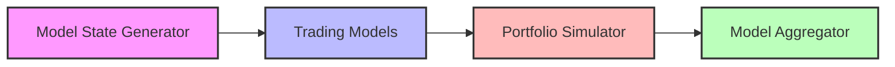
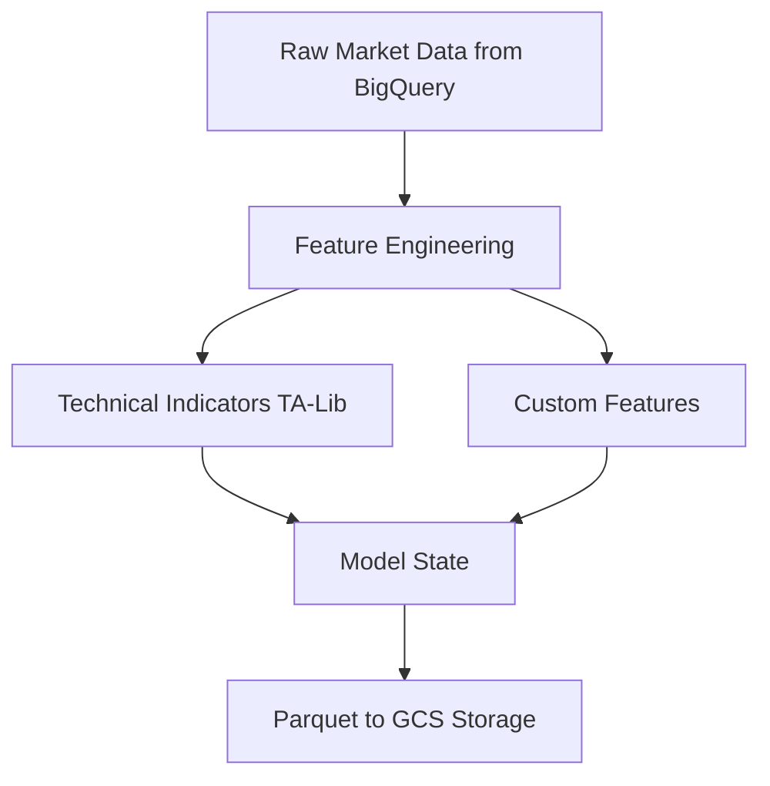
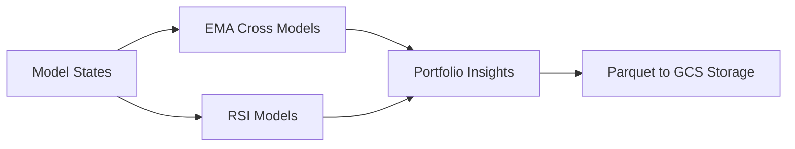
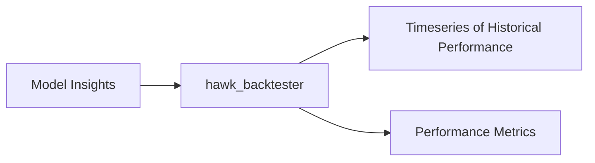
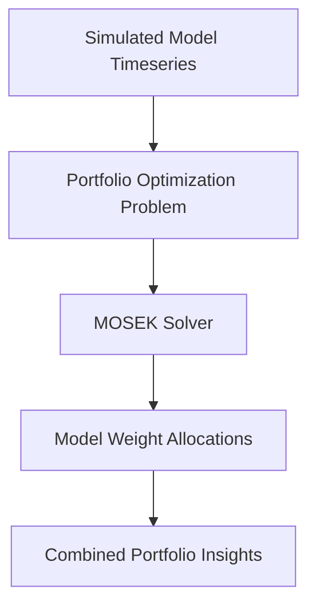
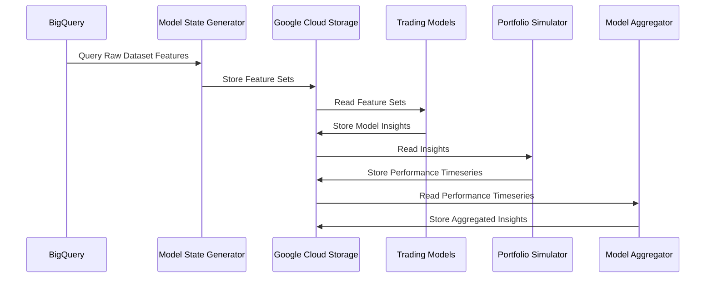
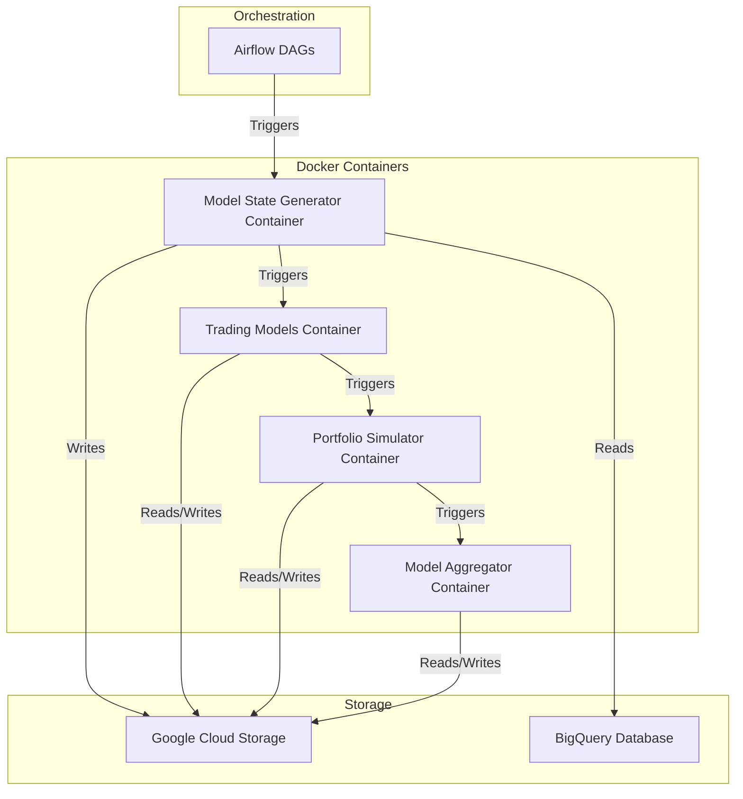

# System Architecture

## Overview

The Hawk Production Engineering system consists of four main components that work together in a pipeline:

## Component Details

### 1. Model State Generator

- Ingests raw market data
- Computes technical indicators (EMA, RSI, etc.)
- Generates feature sets for each model
- Stores results in Google Cloud Storage

### 2. Trading Models

- Consumes model states
- Implements trading strategies
- Generates position signals
- Supports multiple model types:
  - EMA Cross Strategies
  - RSI Strategy
  - Others ?? (To be added, i.e kernel regression, hurst exponent, committment of traders, binary classifiers, reversal indicators, etc.)

### 3. Portfolio Simulator

### 4. Model Aggregator

- Implements portfolio optimization using MOSEK -- Finds optimal risk-adjusted portfolio
- Aggregates signals from multiple models using historical performance & correlations
- Generates final portfolio insights as a linear combination of model insights

## Data Flow

## Deployment Architecture

## Current Services

| Service | Purpose | Key Technologies |
|---------|----------|-----------------|
| Model State Generator | Feature engineering and state preparation | Python, TA-Lib |
| Trading Models | Strategy implementation and signal generation | Python |
| Portfolio Simulator | Performance analysis and backtesting | Python, hawk-backtester |
| Model Aggregator | Portfolio optimization and weight allocation | Python, MOSEK |
